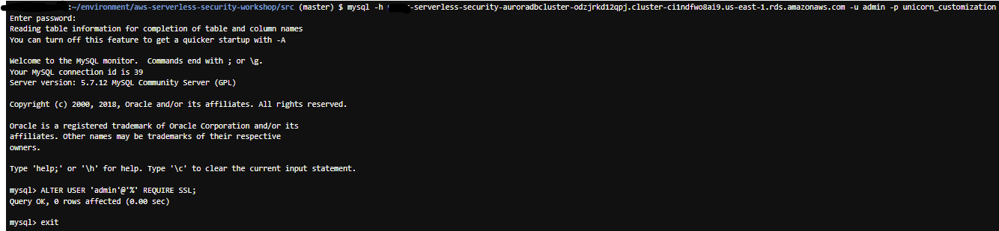

# Module 4: Use SSL in-transit for your DB connections

Although we are using VPC and traffic is private within it, some regulations or compliance requirements might require encryption in transit. This encryption secures the data when communicating with the database. 

## Require SSL 

First, let's make it so that our account used for database connections are required to use SSL. Establish a mysql connection with the admin account:

```mysql -h <YOUR-AURORA-PRIMARY-INSTANCE-ENDPOINT> -u admin -p unicorn_customization```

You can require SSL connections for specific users accounts\. For example, we can require the `admin` account our application uses to connect to the database use SSL \.


```
ALTER USER 'admin'@'%' REQUIRE SSL;  
```


Exit the SQL connection for admin when done.



Test out a few API endpoints in Postman or in browser. The calls should fail with `"Error querying"` as it is expecting an encrypted connection but our application is not yet configured for it. 

## Configure SSL In-Transit

Go to *dbUtils.js* to add a new property to your database connection. Under the method ***getDbConfig***, within the resolve object (a JSON object), add a new line to the JSON:

```
    ssl: "Amazon RDS",

```
The resolve should be like this:

<details>
<summary><strong>If you haven't gone through AWS Secrets Manager step</strong></summary><p>

```javascript
			resolve({
			    ssl: "Amazon RDS",
			    host: host,
			    user: "admin",
			    password: "Corp123!",
			    database: "unicorn_customization",
			    multipleStatements: true
			});
```
</details>

<details>
<summary><strong>If you have gone through AWS Secrets Manager step</strong></summary><p>

```javascript
            client.getSecretValue({SecretId: secretName}, function (err, data) {
                if (err) {
                    console.error(err);
                    if (err.code === 'ResourceNotFoundException')
                        reject("The requested secret " + secretName + " was not found");
                    else if (err.code === 'InvalidRequestException')
                        reject("The request was invalid due to: " + err.message);
                    else if (err.code === 'InvalidParameterException')
                        reject("The request had invalid params: " + err.message);
                    else
                        reject(err.message);
                }
                else {
                    if (data.SecretString !== "") {
                        secret = data.SecretString;
                        resolve({
                            ssl: "Amazon RDS",
                            host: JSON.parse(secret).host,
                            user: JSON.parse(secret).username,
                            password: JSON.parse(secret).password,
                            database: "unicorn_customization",
                            multipleStatements: true
                        });
                    } else {
                        reject("Cannot parse DB credentials from secrets manager.");
                    }
                }
            });
```
</details>

Finally, deploy these changes:

```bash
cd ~/environment/aws-serverless-security-workshop/src
aws cloudformation package --output-template-file packaged.yaml --template-file template.yaml --s3-bucket $BUCKET --s3-prefix securityworkshop --region $REGION &&  aws cloudformation deploy --template-file packaged.yaml --stack-name $STUDENT-CustomizeUnicorns --region $REGION --capabilities CAPABILITY_IAM --parameter-overrides InitResourceStack=$STUDENT
```

Once this is done, you should be able to connect to the database using SSL.

## Ensure SSL - Optional step (CONSIDER REMOVE??? STACK DOES NOT INCLUDE encrypted_user account)

First, establish a mysql connection with the admin account:

```mysql -h <YOUR-AURORA-PRIMARY-INSTANCE-ENDPOINT> -u admin -p unicorn_customization```

You can require SSL connections for specific users accounts\. For example, we can require the `admin` account our application uses to connect to the database use SSL \.


```
ALTER USER 'admin'@'%' REQUIRE SSL;  
```


Exit the SQL connection for admin when done.


`mysql -h <YOUR-AURORA-PRIMARY-INSTANCE-ENDPOINT> -u encrypted_user -p unicorn_customization`

You should be prompted with a password. Use `Corp123!`
This connection attempt should work. Type `exit` to drop the mysql connection.
	
After entering your password, it should fail with ERROR 1045 (28000): Access denied for user 'encrypted_user'@'10.0.1.156' (using password: YES). This is because an encrypted connection is expected and required for this account.

**PW Notes: Verify SSL Login Steps--may need to check if complete**
Connect to your database this time using encryption with the following command. Replace the Aurora endpoint with the one the primary instance endpoint copied into your scratch pad from Step 5.

mysql -h <YOUR-AURORA-PRIMARY-INSTANCE-ENDPOINT> -u encrypted_user --ssl-ca=/home/ec2-user/environment/aws-serverless-security-workshop/src/app/assets/rds-ca-2019-root.pem -p

You should be prompted with a password. Use Corp123! After entering your password, it should login successfully and present with a mysql> prompt.

## Next step 
You have now further secured your data by enabling encryption in transit for your database connection! 

Return to the workshop [landing page](../../README.md) to pick another module.
