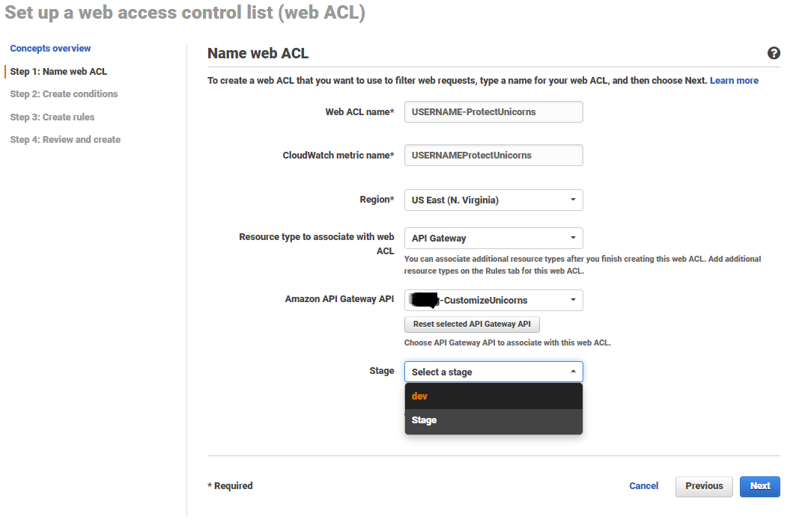
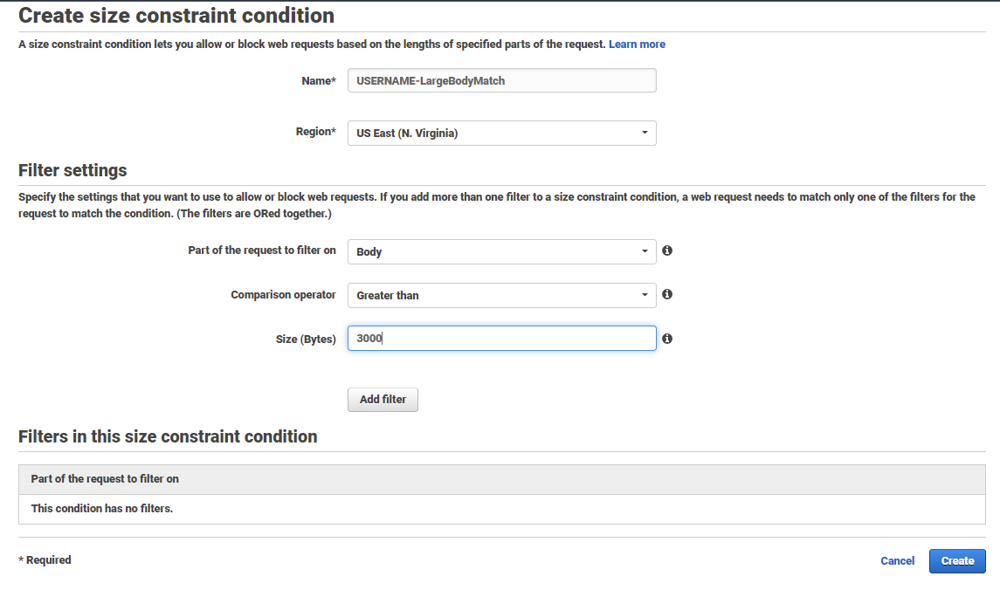
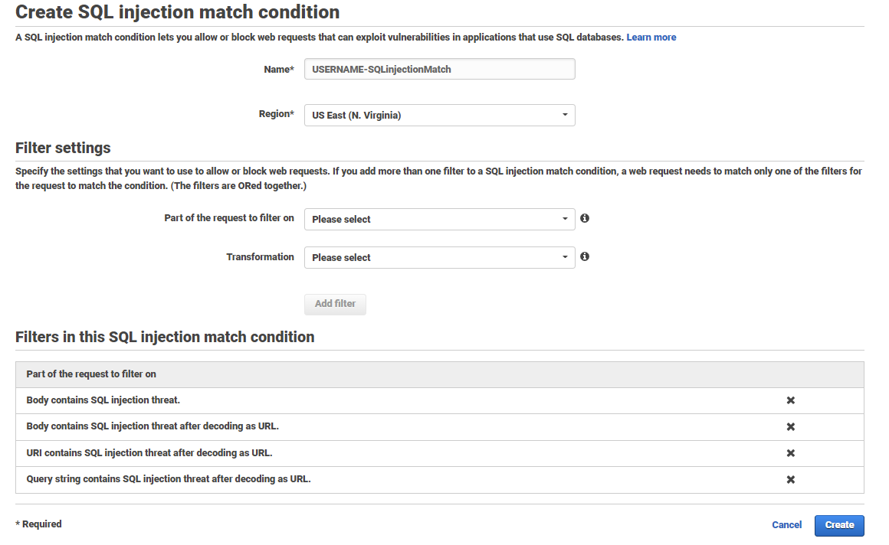
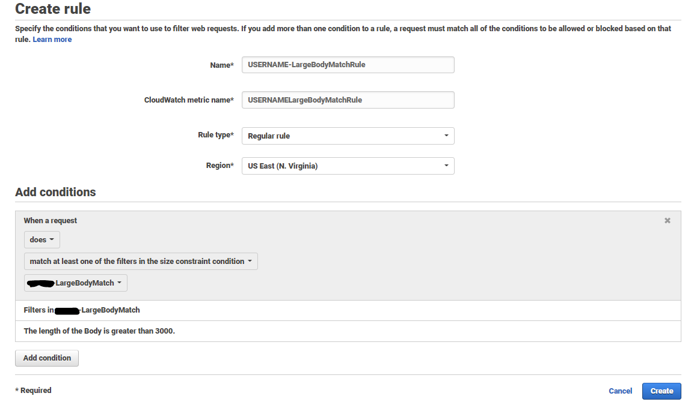
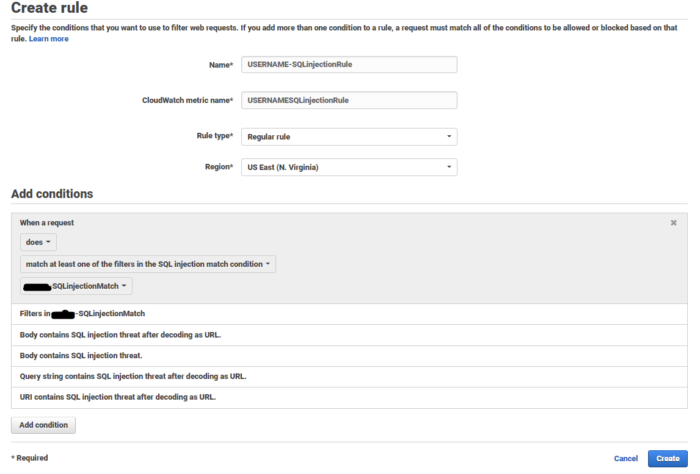
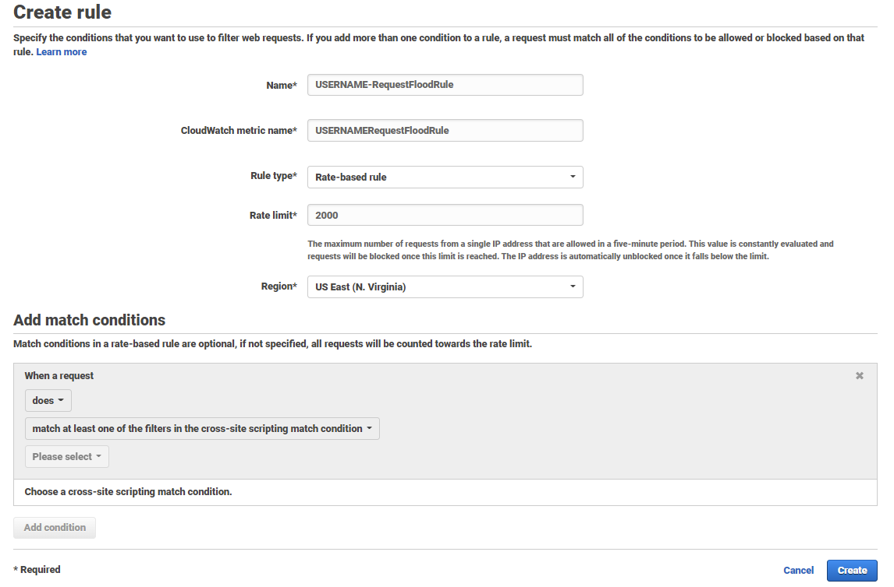

# Module 6: WAF 

AWS WAF is a web application firewall that helps protect your web applications from common web exploits that could affect application availability, compromise security, or consume excessive resources. For example, you can reject requests that matches **SQL injection** and **Cross-Site Scripting (XSS)**. Additionally, you can filter web requests based on **IP address**, **geographic area**, **request size**, and/or string or **regular expression** patterns using the rules. You can put these conditions on HTTP headers or body of the request itself, allowing you to create complex rules to block attacks from specific user-agents, bad bots, or content scrapers. You can also take advantage of **Managed Rules** from **AWS Marketplace** to get immediate protections for your APIs from common threats, such as OWASP Top 10 security risks and Common Vulnerabilities and Exposures (CVE).


In this module, you will create a WAF ACL and attach it to the API Gateway we created.

### Module 6 - Optional: attack your API with SQL injection! (DELETE THIS SECTION)

If you have completed **Module 3: Input validation on API Gateway**, your API now has some basic input validation in place for the JSON request body. However, it turns out our application is still vulnerable to SQL injection attacks as part of the request URI. This optional module shows how you can perform the attack.

<details>
<summary><strong>Click to expand for optional step instructions </strong></summary>


1. In Postman, go to the **GET Custom_Unicorn** request. Change the request URL to include a SQL injection in the request URI: 

	```
	{{base_url}}/customizations/1; drop table Custom_Unicorns;
	```

	and Click **Send**. 

	

	You may get a "`Error querying`" response back because the SQL injection messed up the database query so not all of it succeeded (you can check the Cloudwatch Logs for the **CustomizeUnicorns-CustomizeUnicornFunction** Lambda function on what SQL queries got executed). However, the injected query to drop the `Custom_Unicorns` table should have succeeded. 

1. If you now try to submit some valid quests, such as LIST or POST customizations, you will now get error back, because the `Custom_Unicorns` table got dropped by our evil attack! 

1. To recover from this, go to your cloud9 browser tab, connect to the database again through the mysql command line 
	
	```
	 cd ~/environment/aws-serverless-security-workshop/src
	 mysql -h <replace-with-your-aurora-cluster-endpoint> -u admin -p
	```
	
	If you have gone through Module 4 and set the DB to require the `admin` user to use  

	type in the DB password (if you have gone through **Module 2: Secrets Manager**, your DB password may have been rotated by Secrets Manager. You can retrieve the new password by going to the Secrets Manager and click on the **Retrieve secret value** button 

1. In the MySQL cli prompt, you can run the show tables command to verify the `Custom_Unicorns` table is gone: 

	```
	use unicorn_customization;
	show tables;
	```
	See screenshot: 
	
	
	
1. Rerun the DB initialization script to recreate the `Custom_Unicorns` table:

	```
	drop table Capes, Glasses, Horns, Socks;
	source init/db/queries.sql;
	```
	
	> You should see the output includes this error message: 
	>```ERROR 1062 (23000): Duplicate entry 'Placeholder company' for key 'NAME'```
	> This is expected because we didn't want to overwrite the `company` table. You can ignore the error message 
	
	
6. List the tables again to verify the `Custom_Unicorns` table is recreated. 

	```
	show tables;
	```

</details>

### Module 6A: Create a WAF ACL 

Now let's start creating an AWS WAF to give us additional protection: 

1. Go to the [AWS WAF Console](https://console.aws.amazon.com/wafv2/home#/wafhome)

1. The AWS WAF console has recently released a new version: see [Introducing AWS Managed Rules for AWS WAF
](https://aws.amazon.com/about-aws/whats-new/2019/11/introducing-aws-managed-rules-for-aws-waf/). However, this workshop has not been yet adapted to the new version. Therefore, we will be using the classic version of the WAF console. You can use the **Switch to AWS WAF Classic** button to switch to classic:

	

1. Click on **Create web ACL** on the WAF Classic console

	
	
1. In Step 1 of the ACL creation wizard, fill in:

	* **Web ACL Name**: Prefix your Web ACL name with your USERNAME, e.g. `USERNAME-ProtectUnicorn`
	* **CloudWatch metric name**: this should be automatically populated for you
	* **Region**: select the AWS region you chose for previous steps of the workshop
	* **Resource type to associate with web ACL**: Pick `API Gateway`
	* **Amazon API Gateway API**: Pick the API Gateway we deployed previously, e.g. `USERNAME-CustomizeUnicorns`
	* **Stage**: select `dev`

	
	
	and click **Next**

### Module 6B: Create WAF conditions

1. Next you will create 2 different conditions. Let's start with a condition to restrict the maximum size of request body: 

	* Go to **Size constraint conditions** section, click **Create condition**
	* Give the condition a unique nameprefixed with your username, like `USERNAME-LargeBodyMatch`
	* In Filter settings, add a filer on 
		*  	**Part of the request to filter on**: body
		*  **Comparison operator**: Greater than
		*  **Size (Bytes)**: 3000
	* Click **Add filter**  
	* After the filter is added to the condition, click **Create**

	
	

1. Next, let's add a SQL injection condition. 

	* Go to **SQL injection match conditions** section, click **Create condition**
	* Give the condition a unique name prefixed with your username, like `USERNAME-SQLinjectionMatch`
	* Here, we want to add multiple rules to inspect multiple aspects of the request: request body, request URI and query strings 
	* In the **Filter settings**, add 4 filters:

		<table>
		  <tr>
		    <th></th>
		    <th>Part of the request to filter on</th>
		    <th>Transformation</th>
		  </tr>
		  <tr>
		    <td>1</td>
		    <td>Body</td>
		    <td>None</td>
		  </tr>
		  <tr>
		    <td>2</td>
		    <td>Body</td>
		    <td>URL decode</td>
		  </tr>
		  <tr>
		    <td>3</td>
		    <td>URI</td>
		    <td>URL decode</td>
		  </tr>
		  <tr>
		    <td>4</td>
		    <td>Query string</td>
		    <td>URL decode</td>
		  </tr>
		</table>
	* Click **Create**
	
	

1. Click **Next** to advance to the **Create rules** page 


### Module 6C: Create WAF rules


1.  Next, we create **Rules** that are composed of one or more **Conditions**. Let's start by creating a rule based on the request body size condition:

	* Click **Create Rule** 
	* Give it a unique name prefixed with your username, like `USERNAME-LargeBodyMatchRule`
	* For 	**Rule type**, keep `Regular rule`
	* In Add conditions section, select 
		* 	`does`
		*  `match at least one of the filters in the size constraint condition `
		*  `USERNAME-LargeBodyMatch`  -- the name of the condition you created for large request body in 6B 

	* Then click **Create** 
	
	
	
1. Next, we create the rule for SQL injection. 

	* Click **Create Rule** 
	* Give it a unique name prefixed with your username, like `USERNAME-SQLinjectionRule`
	* For **Rule type**, keep `Regular rule`
	* In Add conditions section, select 
		* 	`does`
		*  `match at least one of the filters in the SQL injection match condition `
		*  `USERNAME-SQlInjectionMatch`  -- the name of the condition you created for SQL injection in 6B 
	*  Then click **Create**

	

1. Lastly, we can create a rate-based rule that prevents an overwhelming number of requests (either valid or invalid) from flooding our API:

	* Click **Create Rule** 
	* Give it a unique name prefixed with your username, like `USERNAME-RequestFloodRule`
	* For **Rule type**, select `Rate-based rule`
	* For **Rate limit**, use `2000` 
	*  Then click **Create**

	
	
1. You should now see 3 rules in like below. Ensure you select `Block` if the request matches any of the rules. 
 
	For **Default action**, select `Allow all requests that don't match any rules`

	

1. Click **Review and create** 

1. In the next page, review the configuration and click **Confirm and Create** 	
	
	

You have now added a WAF to our API gateway stage! 

### Module 6D: Test requests with WAF protection 

1. First, send some valid requests using Postman to make sure well-behaving requests are getting through. 

1. Next, we can easily test the large request body rule by sending a few **POST /customizations** requests with a giant request body. If you don't receive an error immediately after applying WAF, you might need to wait a minute to for these changes to propagate.

	In Postman, choose the **POST create Custom_Unicorn** request and replace the request body with: 


	```
	{  
	   "name":"my custom unicorn",
	   "imageUrl":"https://abc.efg.com/YA3K7yOwfmKhD1SdZ0MDB9C97RnJ3vb74WmoPOGJb2crs04okE2TcghSVgMWBLZ0c7rYZA5sjPWdfU7GJsRnEexwqgVfq2c94jEYdBCyxrZA3bZY36MiBnQZDrMyMMq1I8WJ7U4otss7mNWyQON0suZFXGCV7g7Z15dh14FIemSrkw3MzBLjsoAGTaz4VW1Ftljt5FCyJG3GtCSRvIoBkJ1YNiqKDRuiyFud7RgxBTXJEj3VvpTtT5CfWKPKKwfal4q506gW6aBgTeZGlhIGWlCxuT6sIYPodrXX4xmfukCFR32wtk7VgEiqYpKKwey2uQnZNQJHqwbHFZakppNYDQAeJ6NqB0tLDhERX2KtEiXH7iEJgAXeMLd7PNWrhYIlycsbcVnNrSpCmnBwADM3uVrKVF78qNGN2DnazascF3rIFSZJMPvNocSIT4zlK8VmXxB8inJb56UEHsYn9LAfVQMFcXPU3xwmKljk2fz5lHHs6vPeDnqjDNMEm1sXFq3S4759GZXzQubDcjYHX3REqeUNPYokrMAFb28qkfQwXUvrAq4Ov5eMXhFeXMBwupfqsSpPz0CMhr8o0M8sjG7ilXvrMo0jVcEmUrfRshkTHs55gZsaXP2CXjSbK0Z6sNiIiNtngAmHBZ1UkjJplirwVYLYAarYbghRdQswrWki447NtS0iFibgOjGkDXpFYwxaqNehMhalLUnP5jfz125V7HNzQ0wX5jgm42yGEjBaGNcI8hcySPXNI4jvT8RlZYxMs8m0zeZxxHEXqVfqVFYEr63gsI33nVPXS5jnJs7x3KY4wBOmOmwzWBBb62dBYBzqMwtRKp560MsR7uOK2hMGTBSdQtNubetRtu5JClGhlqE7Zv4SQ44lraE87vat55nXTgma7xpAjpwiH6yDQW6x1EXxjfVccjvR44FJNtUFVBh0DqUwoThR57SaEuIrLlP7e2pysgBI9GsYVt5RnXVUMXSPaDknVY4dFLVEPSEoOVRAt1kMcW9R3v3jURBBvTXfsFLzXn2t4DAYA1QmhJDkt9xpUOs1sviBYqjpUdhmRaun14Fx7aQiuwKAsfyJyVPbgZgmxOkeWpkf4ohcKwGZI8T6UlVWrwiRVL6eVQOdb3stNitObefEF7c9G9THQURzwpm7DanLTcAmnjlTyZS2NOW84it8QxDZ4qFGuxSjmzoGUUai9FRSpmyTozJvjmwZUFF5Codn9UWN2RrrEfKbuufl5ErPGRdyNkL73Hw9t1RG3UObmc0sf34z0JsHaL07StwB9HIXm5SLu9aZIpGoRu4UU23YL8jgORSXVop3HdkFifVTBf2w2mXaL0r07MHwLXQC7olLdNSXvj9uqVySHhAvAnhYquF0dwartwByZWT3Zt4i5gueuCb2LgrJJTSYQeDz9HIA4oDSnWj9BaxXKDuBTyLPwAdB4ER7I2Kl7lgdKuknaHXh5z9f4ybonueDv3RBd2Hcny5256im7jE6rEIWtTIbTKCR0frmpWm2smmwfL2IQIJE0lp5kxfDroqNf5l1XrovOo9sTD4LYIf88mUI3cAbBwNnPDtSZIWTJ3XcoK8Rm88xb3xKUxCZsQNnxBJM1eWzrYe4rSzIKk887GwwBAK1NFustp8bxSS3F73e2Oh9ijpbFBaAgmlG7nb21pEMBAw3G0yK6Hb0YePZvtXCxPQXDzFg5ya5BvqVPZESIAlkxNCz7kr0lTYJgwnixLUyM6gW6BekQAznQdaTK8LHYN9xJZusRgcSsVmfmA59KZ4J4oKxSAF4G14yI1P1Hj3juHHP8A90OjHfDvzkxGgL81CduPkBhyTRlhXg5mfIcEVGCViySt3cQGSYj43uo3sJ0JD77G7s5rc8kcc9VKPJ7sm1KZwNhF5lj6Ew1IOLG45xhrOOcJ8IvWAutcbFScOU0bZqwXyAi1ZLagPeVkkUBVHQKlHDUaQsuWXYnGyEO51Q5rgv6zdeFJlc32bjO1KelHURGznCHQgMB4rUlQUff482NWtoIC97Sp2es71nH88vzJf3yEiALXPe9a2XIWq5iAJpOr5SFFYJApDQ84k7UTLp2eiv7pZObd8CoT1RM7D5HepHdULl2wuzOKzugK7rQSgFrdndZEstMwwl0Rd6QH7ecuyidcjebuxT021M98ngzHBnki0muGFpYtWeO88IrqFsvSdb7PwARLZQFERcRfkYmynJ2xLnYLsNGw3Zim8lMqBKj06OrY6obubc5oNxyk3tzYAuhJhouNj6qIMaQYSBxkmDQuMsjJ8ULTaODdJuBNxp6wYPNyR4150dKukBc3fifzhcXQZP5KRudVf1nsDLYvQILifTJzSa01vwyxEhqCAEFZXnGuhANOwPWYuB5iagGErZ1MfNmlBCqYycveVjU0M7JWxZBPvHzLDFb3K9p91lO9URPXsieywBkFiP9RY0kSdktrwF8gHBiqacxPKFoS80o4PRfjr18ZOkT3XKGFiaQ9N3ubU1JzfGa3wvguPwlt0B4xk50jVnI45qeJAMpWBwEC8niMO7DIVBwxN0ERVrLpoOwdsE97xisGz5utDMqGi7IUpHozeCne9HYYxRAbia9skHgxAdsu64O7MSunuKxNs48wP9ClaeFyu6Yq6K8pGfUz54hxuDozlMRsIeawrqzj4CFl7AlDAtHyBLLuZIoAYo4f5evKyTPkcrF32YhhtINxlKGBJzCWKr6CTr76sPrbIbCyca94ymUILS09e0OYM7hlUqbzL4BBcPAWdr76akCmemeWayWbeF5piZUN4Zx8du5QINRnBGZo6T1CQmIQYJEEKKaQYfIiykitvq9v4ITF7TukiP1STzPJpL9SIJcxOBZjFmVaCK9sJeFQasXgJu2pAgdW41h0e8t7ygrlR6VZG1mKvk6QmTSCNOhMVrM5R74ZMlBfsJzvrOFgzoed0qOJg3rV4Te3BthONwYme1h9f5vQGRsxUu3UQnbIx8tIgVCYOsAEt6Jjho58AYYyZSGC5QYwRmqX6qd2O2cl8razz8cECzrGgHHaUsWVynpnW7RyAhZ6WrjN5sXANcRtEoeyK7gSIp9M0KhrItJNh0a6M6TEfFLMKOXV19YjZkJoalv5nQoy9V7dexFzvmtEtwnPwClSSEr9HczxFkpMCKzoCJwnlNlgSqkZ2Pw4mQSt05OmNqiyhnDw1rzTQgdMv8YdbWoD9Wkiln0UXghv816dcV3ZZD2UtF5yIeU4oo39ghfHW8MoccOcp6iasAMaEiENwha9D2p9J2Z0SwsOiS9gtjwVh4KdMc4EKcJdHkQAJ2iL3ZTulpuHmBo5yczOkJh2k1EZ7qaamOccvuxCPQE3Yofh5ztwHCIMFoM9pqRJRrW2ZXY1VbHKotiNSrWXnzunOKRktCEIKHXb4kN3q3iDwpiW5Ndno3I9CDmb5HihMsTom5kUmQIwgJpWZkrSUkakNbIP0eUe9GgosjqsvGNax9is46zedXoMHqwF1Qg7MQfy23NtCAvndwkpwmaoaFmhObg9TpFmI6skEmDrPAw4pArL0LalgPFXiqxoVyOouPdgwk6U1gQaWLG0gWBRki1RPn0Ikw6j4MAvs0jIVetqBNkTnLmVPU7qxHxMv0jxiDta8xz12LfQeOSQmtvjn66W5GwBy4KAvtttUKzgApJQOEUq2ynPXoKmtzlY9UQ9TAapTHm1qQA2FoZOL4GE9lKPAY4VxjsDFk1WvyCvWVlAkVT8qIlhOmnPPw0l7o9DpnMt66Hls6OJuqIfwisBhidht2MMw5nZ76gDbSrYKq3lVfMow9MGz9xfEoxFyWxPNEFlN0VUsLFvA37NwwuiwueIt6HjnGWdYcLe1LqZLtUwtQjLuizq87OYT6WKrGxnjqMFfBhEbdGBRIzioPLlRQijBMTdh0iD2YXwU4gdRMTGyb4ZrYmry0aiKojCTEZ5wFFvnDnIeaz869chZdhSb7QxeLpOZSwjsaSSyAhSY2fU3S08GQnCM7z5qvNHzvFbyFDaCh5h1YNysdyPs6Sml5wGqu475hBQnGkQiHNYbTfNohqIMyPpHju1OlbqP8P77DLy39cFf7j8EE7ExhHwI4tiDjiV0ipIYOuTPQZGe12XBu1kAYDcy4I9YqnSIx184JIOayPTdjJOXJ6DzdBfkePpLOWhHVoYaYYGkhzZgcoaPpjxGFhkZF32s28oOKXLTZx98eE9DRd7riISYn8O7nLpIVNJlH5J7pDdobAdGshjfgY7I5SfeaiI6MiE7rDnnyBXDy0SFId8zmpWYmXyBVw5rIrvy1Q8f0JSHhP6NoPcPeF3wbMVOdJ5d5OBZZrO1QhLeWvpEMzBV03xCK9vP985NRzWvOuWkLQXHNANmGhekspm6DruDSAkgU9qpBgUonwsfszz5TiP3F2CKFDGp3BXTBbRmy9nizz3wULa6Ny3276ILHpiFHl7g6H1Bkpo9g5EROGz7PNwxOw0wBJ74UEyky31CYDzanN45kvbf3crM9V8V0Y8B4zD5VSwW1M3RqEYWcyrRkgArjpEEkaWhyyMC7dCk6DWrbdxlDS9iD6gNXMIA1frZu1UegacgPuCsakfz262CJ6Qdyk6xkN97zH8iZakMnx570lipWm4wSbAlTkQVL88NfLHAnaS3kLeSTLkZFtULiKGahy4HkusJsn55dbxu1h7AtWFF54FOhGzGa9yxxnSqbn56KYASpghTOecg0du6ttjEE7ajbYFlOnF1atHOvSKskY9WZdMuee5yBvKQKIwXvUtyrDF55v8ArlEBHl3WFJf08KoYQrF6yxIxDXxhjG3I32G2Qxlj7o6dunk7yEvkrFeKwYpwqHUYs1UlJwoxpEyIjdppOxOxMysILvdh9eSvCdiq2nufwBeLxQqWoHQKa1kDHDR8gGm4ASDcoy53fZB9WykV0ylvpbzJtsPrKIXyTEV8FLUx3FcUkCCCcBuh8t3hCMpMOuSe0EsSjBaInXtR2h0nL7MGq8lUicCIbeVBfkF4O",
	   "sock":"1",
	   "horn":"2",
	   "glasses":"3",
	   "cape":"2"
	}
	
	```
	
	You should see your requests getting blocked with a **403 Forbidden** response
	
	&#128161; **Note:** It may take a minute for WAF changes to propagate. If your test request went through successfully, retry a few times until you start receiving 403 errors as WAF kick in effect.  &#128161;
	
1. Next, let's try a request with a SQL injection attack in the request URI for a **GET /customizations/{id}** request

	In Postman, choose the **GET Custom_Unicorn** request and replace the URL with: 

	```
	{{base_url}}/customizations/1; drop table Custom_Unicorns;
	```

	You should see your requests getting blocked with a **403 Forbidden** response

1. The WAF console gives you metrics and sample requests that are allowed/denied by the WAF rules. You can find this information by going to the WAF console, under **Web ACLs**, select the AWS region and then the WAF we just created. 

	**Note:** It can take a few minutes before the metrics and sample requests start showing up in the WAF console.

	

## Extra credit 

Use a load test tool like [Artillery](https://artillery.io/docs/getting-started/) to test sending more than 2000 requests in 5 minutes to test the request flood rule. 

Note that you will need to configure Artillery to send the `Authorization` headers.

If you have completed **Module 5: Usage Plan**, your API may be throttled first by the usage plan based on the API key. 

## Want more?

In this module, we only explored 3 types of AWS WAF rules:

* SQL Injection
* Request size constraint
* Rate limiting 

There are a lot more other types of protection you can enable, based on the types of risks you want to defend against 

Check out the below to learn about other type of rules: 

* AWS WAF Security Automations: [https://aws.amazon.com/solutions/aws-waf-security-automations/](https://aws.amazon.com/solutions/aws-waf-security-automations/)
* Managed WAF Rules from AWS Marketplace: [https://aws.amazon.com/marketplace/solutions/security/waf-managed-rules](https://aws.amazon.com/marketplace/solutions/security/waf-managed-rules)

## Next Step 

Return to the workshop [landing page](../../README.md) to pick another module.
